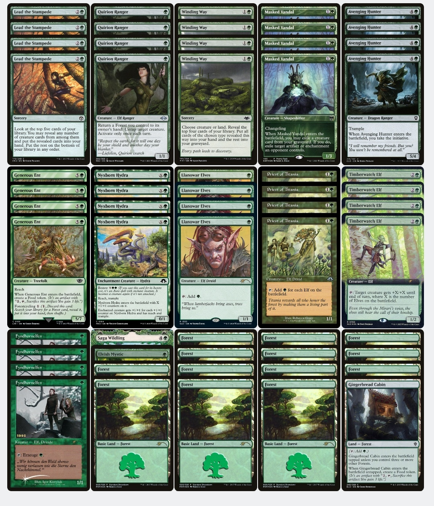
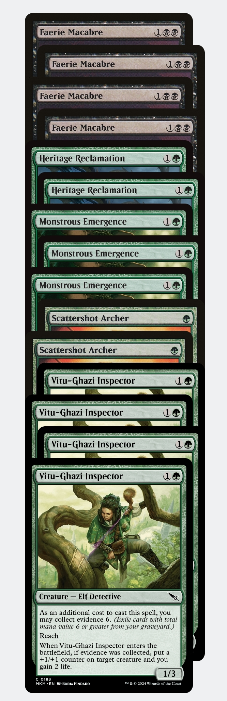
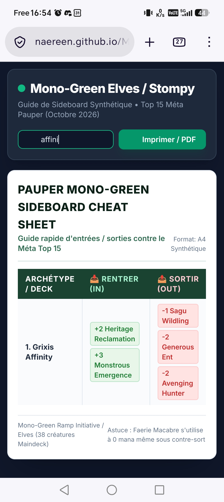

# Mon plan de sideboard en Pauper au PauperNATION 2026 (Magic the Gathering en format Pauper)

En direct depuis le trajet en voiture vers ce grand weekend festif de Magic en Pauper en France...
Allons perdre avec le sourire au PauperNATION !

<https://www.pauper-france.fr/paupernation.php>

## Mon deck pour ce weekend

Je jouerai Elfes mono vert !
Ma decklist est là :

<https://moxfield.com/decks/bN-gAeL3iHSvgQPfrwn14w/>

----

## Visuels de ce deck

### Deck principal

### Réserve

----

## Table du plan de réserve

Contre la quinzaine de decks les plus populaires en ce moment :

| Archétype / Deck | 📥 Rentrer (IN) | 📤 Sortir (OUT) |
| :--- | :--- | :--- |
| **1. Grixis Affinity** | +2 Heritage Reclamation +3 Monstrous Emergence | -1 Sagu Wildling -2 Generous Ent -2 Avenging Hunter |
| **2. Jund Wildfire / Gleam** | +3 Monstrous Emergence +2 Faerie Macabre +2 Heritage Reclamation | -4 Masked Vandal -1 Sagu Wildling -2 Avenging Hunter |
| **3. Kuldotha Red / Rally** | +4 Vitu-Ghazi Inspector +3 Monstrous Emergence | -4 Masked Vandal -1 Sagu Wildling -2 Avenging Hunter |
| **4. Dimir Terror (UB)** | +4 Faerie Macabre +3 Monstrous Emergence | -4 Masked Vandal -1 Sagu Wildling -2 Generous Ent |
| **5. Golgari Gardens** | +4 Faerie Macabre +3 Monstrous Emergence | -4 Masked Vandal -1 Sagu Wildling -2 Llanowar Elves |
| **6. Mono White / Caw-Gates** | +2 Scattershot Archer +3 Monstrous Emergence +2 Heritage Reclamation | -4 Masked Vandal -1 Sagu Wildling -2 Priest of Titania |
| **7. Jeskai Ephemerate** | +4 Faerie Macabre +2 Heritage Reclamation | -4 Masked Vandal -1 Sagu Wildling -1 Generous Ent |
| **8. Dimir / Mono U Faeries** | +2 Scattershot Archer +4 Vitu-Ghazi Inspector +3 Monstrous Emergence | -4 Masked Vandal -4 Avenging Hunter -1 Sagu Wildling |
| **9. Gruul Ponza / Ramp** | +3 Monstrous Emergence +2 Faerie Macabre | -4 Masked Vandal -1 Sagu Wildling |
| **10. Walls Combo** | +3 Monstrous Emergence +2 Heritage Reclamation | -4 Masked Vandal -1 Sagu Wildling |
| **11. Selesnya Bogles** | +2 Heritage Reclamation +4 Vitu-Ghazi Inspector | -1 Sagu Wildling -2 Quirion Ranger -3 Avenging Hunter |
| **12. Azorius Familiars** | +4 Faerie Macabre +3 Monstrous Emergence +2 Scattershot Archer | -4 Masked Vandal -4 Avenging Hunter -1 Sagu Wildling |
| **13. Pinger Tron / Egg Tron** | +4 Faerie Macabre +2 Heritage Reclamation | -4 Masked Vandal -1 Sagu Wildling -1 Generous Ent |
| **14. Miroir Green Stompy/Elves** | +3 Monstrous Emergence +2 Scattershot Archer | -4 Masked Vandal -1 Sagu Wildling |
| **15. Rakdos Madness / Burn** | +4 Vitu-Ghazi Inspector +4 Faerie Macabre +3 Monstrous Emergence | -4 Masked Vandal -4 Avenging Hunter -1 Sagu Wildling -2 Generous Ent |

## Licence

MIT Licensed
